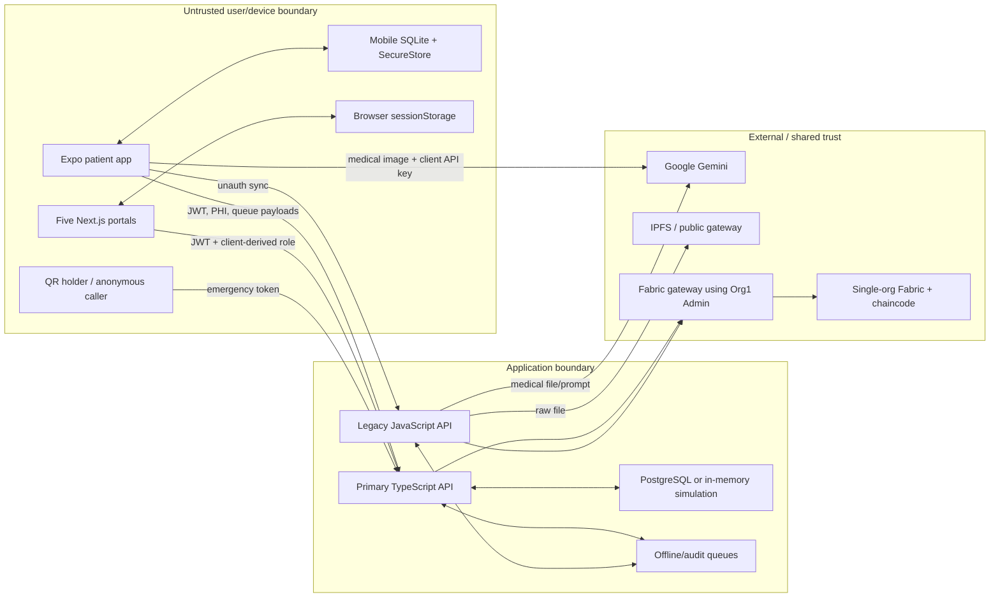
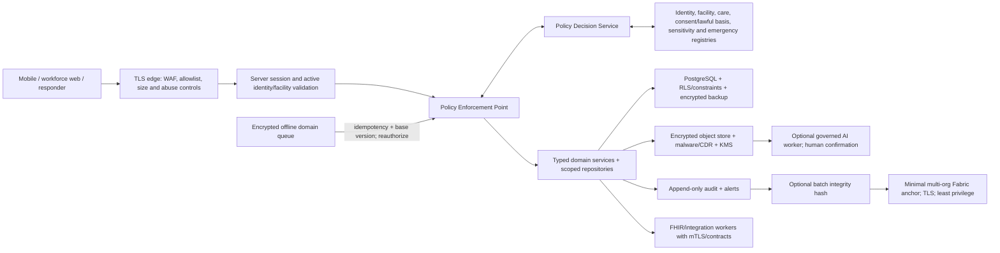

# PalmChain V2 Data-Flow and Threat Model

**Method:** asset/actor/entry-point inventory plus STRIDE-style analysis, privacy/linkability analysis, clinical-safety and availability considerations.  
**Boundary:** current repository at `main@871eb5f3968f53921b07c6acade1531e1acc5bbe`; live deployment and external processor configuration are unverified.

## 1. Security and safety objectives

1. Only the right person, in the right role/facility/care relationship, for an approved purpose and lawful basis, can perform the minimum necessary action.
2. Patient identity and clinical content remain confidential at rest, in transit, in logs, analytics, AI, files and ledger metadata.
3. Clinical records, consent, audit and provenance cannot be forged, overwritten, replayed or represented as committed when they are not.
4. Offline/degraded behavior preserves truth, authorization and recoverability; dependency failure never becomes simulated success.
5. Patients and clinicians understand whether data is local, queued, saved, signed, committed, verified, revoked or failed.
6. Emergency access is fast but authenticated, minimal, timeboxed, justified, reviewed and visible to the patient where safe.
7. The system is recoverable from service, device, credential, database and organization failure.

## 2. Actors and assets

### Actors

Patients/guardians; doctors; nurses; laboratory staff; pharmacists/staff; facility administrators; PalmChain operators; Ministry analysts; privacy/audit staff; emergency responders; facility/Ministry integration clients; external AI/storage providers; malicious anonymous caller; malicious/compromised authenticated user; lost/stolen device holder; compromised dependency/build operator; Fabric organization member.

### High-value assets

PHI and identity; consent/lawful-basis evidence; emergency dataset; workforce credentials and facility assignments; sessions/tokens/QR capabilities; files and AI content; signing/encryption keys; Fabric identities and ledger state; audit evidence; database backups; FHIR/client credentials; aggregate datasets; model prompts/results; billing/cost quotas; release/deployment configuration.

## 3. Current data-flow diagram

### Critical current trust failures

- `L` accepts sensitive anonymous requests (`backend/api/index.js:17-249`).
- `M` carries an AI credential and sends a medical image directly to `G` (`app.config.js:46-51`; `src/services/aiService.ts:52-126`).
- `Q` can receive extensive emergency PHI without responder authentication (`access.routes.ts:92-130`).
- `T` trusts broad JWT roles and route-local consent instead of full resource/context authorization.
- `P`, `F`, AI and mobile auth can substitute simulation for failure.
- `F` uses an administrator identity and `C` generally fails to authorize caller/subject.
- `C` and audit anchoring expose linkable subject/actor metadata to a shared ledger.

## 4. Target trust-boundary diagram

## 5. Entry-point threat register

| ID | Entry point / threat | Category | Current evidence | Impact | Required controls | Residual/unverified |
|---|---|---|---|---|---|---|
| TM-01 | Credential stuffing/account enumeration on login | Spoofing/abuse | login routes have no endpoint-specific limit; patient-not-found/static password (`auth.routes.ts:95-147`) | account takeover/PHI | MFA workforce, verified patient onboarding, per-account/IP/device throttling, generic response, revocation/risk alerts | live IdP unknown |
| TM-02 | Client role/facility tampering and stale JWT | Spoofing/elevation | middleware trusts claims; portals trust sessionStorage (`auth.middleware.ts:14-33`; `doctor-web/services/auth.ts:62-132`) | cross-role/facility access | server session, active registry checks, short TTL/revocation, central ABAC | deployment/session store unknown |
| TM-03 | BOLA using another patient/resource ID | Elevation/disclosure/tampering | arbitrary record patient UUID and unscoped audit (`records.routes.ts:15-94`; `audit.routes.ts:13-30`) | PHI alteration/disclosure | scoped repository queries, ABAC, non-enumerating denials, negative tests | DB RLS absent by schema inspection |
| TM-04 | Anonymous AI/file/sync/notarize use | Spoofing/tampering/DoS | legacy routes lack auth/limit | PHI loss, cost, forged state | disable gateway; authenticated typed workers; quotas and schemas | historical exposure unknown |
| TM-05 | Oversized/malicious file | DoS/tampering | in-memory multer without size/type; no malware scan (`backend/api/index.js:26-27`) | memory exhaustion/malware/clinical corruption | streaming upload, allowlist/size, malware/CDR, quarantine, checksum | no live storage inspection |
| TM-06 | Prompt/content injection and unsafe AI output | Tampering/clinical safety | image+prompt to Gemini, JSON trusted, simulated conclusions | misleading record/unsafe care | narrow task, isolation, schema, allowlist, abstention, human confirmation, evaluation/monitoring | model/provider configuration unknown |
| TM-07 | QR theft, replay, guessing or shoulder-surfing | Spoofing/disclosure | permanent emergency token; normal ttl can be 0 | emergency PHI exposure | opaque high-entropy token, short TTL/audience/purpose, one-time, revocation, responder auth, anomaly alerts | printed tokens may persist |
| TM-08 | Consent forgery/overbreadth/replay | Tampering/elevation | arbitrary/broad grants and unauth sync | unauthorized access, invalid legal basis | versioned schema, informed receipt, context policy, transactional decision, replay protection | current grants need migration |
| TM-09 | Break-glass abuse | Elevation/repudiation | anonymous emergency resolver | covert browsing/no accountability | strong responder identity, reason, minimum dataset, timebox, alerts, review, patient notice | emergency connectivity policy required |
| TM-10 | Offline queue tampering/replay/stale permission | Tampering/repudiation | arbitrary JSON, Math.random IDs, unauth sync, no versioning | duplicate/lost/unauthorized clinical changes | encrypted store, UUID/idempotency, base version, device/session binding, sync-time ABAC, conflict UI | OS/device behavior untested |
| TM-11 | Database outage causes fabricated success | Integrity/availability | DB switches to mock (`db.ts:530-579`) | lost records and false assurance | fail closed, readiness gate, durable transactions, explicit degraded status | live DB topology unknown |
| TM-12 | Fabric outage or error causes fabricated anchor | Integrity/repudiation | fallback and generated hash (`FabricGateway.ts:30-160`) | false verification | exact transaction ID/commit receipt, no simulation, circuit breaker/readiness | deployed channel unknown |
| TM-13 | Compromised Fabric member invokes privileged chaincode | Elevation/tampering/disclosure | missing caller authorization in contracts | forged providers/consent/audit and metadata reads | MSP/attributes/object checks, endorsement, least privilege, private/off-chain data | current enrollment perimeter unknown |
| TM-14 | Tracked key/client AI secret extraction | Spoofing/elevation/cost | tracked `priv_sk`; client Expo key | provider/ledger compromise | rotate/revoke, history cleanup, secret manager, bundle/repo scans, managed PKI/HSM | whether copied is unknowable |
| TM-15 | Audit log forgery or cross-facility browsing | Repudiation/disclosure | unauth audit sync; unscoped query; audit chaincode open | no trustworthy investigation; PHI metadata leak | server-only event generation, scoped views, append-only store, integrity root, SIEM | existing event provenance uncertain |
| TM-16 | Sensitive data in URLs/logs/errors | Disclosure | AI key in URL; `err.message`; console identifiers | credential/PHI exposure | no secrets/query PHI, error catalog, redaction, log tests, retention | provider/proxy logs unknown |
| TM-17 | Dependency/build compromise | Tampering/supply chain | root audit includes critical; no CI/SBOM/signing | malicious release/secret theft | lockfile/toolchain policy, SBOM, SCA/SAST/secret scans, provenance/signing | advisory reachability needs triage |
| TM-18 | Backup failure/ransomware or operator error | Availability/integrity | no backup/restore evidence | irreversible health-data loss | encrypted PITR, offline/immutable copy, restore exercise, dual control | infrastructure unavailable |
| TM-19 | Government analytics re-identification/small cells | Privacy | broad mock national dashboards; no disclosure controls | re-identification/discrimination | aggregate-only pipeline, k/small-cell rules, query review, contracts, audit | population/metric thresholds require approval |
| TM-20 | FHIR/integration client overreach or schema poisoning | Elevation/tampering | integration boundary absent | cross-system breach/clinical corruption | registered clients, mTLS/OAuth scopes, contract/purpose, profile/terminology validation, provenance/idempotency | Ministry interfaces unknown |

## 6. High-risk flow analysis

### 6.1 Patient lookup and chart access

**Current flow:** workforce portal sends JWT and patient ID to primary API; route checks broad role and a consent predicate; SQL returns demographics/emergency/records.  
**Threats:** ID guessing, wrong facility, stale role, care-relationship absence, broad clinic/role consent, field over-return, existence enumeration, mass list scraping, audit query leakage.  
**Controls:** exact patient matching/MPI safeguards; server active role/facility; assigned care/task; lawful basis/purpose/category/sensitivity; scoped query projection; pagination and anti-scraping; access audit/notification; uniform denial.  
**Current result:** Critical gap.

### 6.2 QR/NFC and emergency

**Current flow:** patient creates normal/emergency token; any holder can present emergency token; API resolves extensive profile.  
**Threats:** copied photo/print, permanent replay, public posting, brute force, discarded card, coercion, excessive notes/contact exposure, no responder accountability.  
**Controls:** never encode PHI; short opaque token; issuer/audience/purpose/expiry/one-time; patient revocation and rotation; responder authentication and reason; minimum clinically approved dataset; timeboxed session; review and notification; rate/anomaly response.  
**Offline decision:** a printed minimum dataset may be safer than a nonfunctional token in some emergency settings, but requires explicit clinical/privacy approval, expiration/version marking and patient control. It must not claim live revocation when offline.

### 6.3 Consent and revocation

**Current flow:** patient submits caller-defined grantee/access/categories; clinic/role grants can be broad; revocation updates records; sync may be anonymous.  
**Threats:** confusing consent, invalid grantee, overly broad purpose, missing expiry, replay, non-atomic approval, access during revocation race, inability to prove notice/version, applying consent as sole legal basis.  
**Controls:** approved taxonomy; granular requested action/category/purpose/time; identity/facility validation; informed accessible receipt; versioned append-only evidence; transactional approval; immediate future-effect revocation; cache invalidation; audit/notification; authorization still checks care/task and sensitivity.

### 6.4 Offline clinical work and synchronization

**Current flow:** arbitrary operation is serialized locally and later posted to legacy sync endpoints; failures may be swallowed.  
**Threats:** lost/stolen device, local database extraction, payload modification, duplicate replay, wrong ordering, stale base, permission/consent revoked while offline, clock skew, partial server commit, misleading “synced” UI.  
**Controls:** minimize offline writes; encrypted DB/hardware key; per-operation UUID/idempotency/base version/dependency; authenticated device/session; sync-time ABAC; atomic domain transaction and receipt; conflict classification/user choice; dead-letter recovery; explicit local/queued/syncing/conflict/committed states; remote/session wipe and backup exclusion.

### 6.5 Medical files and AI

**Current flow:** mobile sends image directly to Gemini with client key; legacy server can send anonymous upload to Gemini or raw IPFS.  
**Threats:** secret extraction, PHI processor disclosure, malicious documents, prompt injection, model hallucination, JSON/schema poisoning, public immutable file, retention/residency breach, cost exhaustion, clinician automation bias.  
**Controls:** disable current paths; authenticated pre-signed managed upload; streaming allowlist/size; quarantine/malware/CDR; envelope encryption/KMS; processor contract/residency/retention; narrow server job with quotas; structured validated output; provenance/confidence/abstention; clinician compares source and confirms; monitor drift/error and kill switch; never use AI result to autonomously diagnose/treat.

### 6.6 FHIR and Ministry integration

**Current flow:** not implemented beyond local shapes/claims.  
**Threats:** identifier mismatch, wrong patient, excessive scopes, bulk extraction, schema/terminology ambiguity, duplicate events, provenance loss, data residency and analytics re-identification.  
**Controls:** interface agreement and DPIA; master-patient/identifier reconciliation; approved FHIR version/profiles/terminology; mTLS/client auth/scopes; patient/facility/purpose context; security labels/provenance; idempotency and reconciliation; aggregate/de-identification/small-cell rules; contract tests and monitoring.

### 6.7 Fabric anchoring

**Current flow:** privileged gateway or anonymous legacy caller invokes single-org Fabric; chaincode stores identifiers/metadata and generally trusts caller arguments.  
**Threats:** key compromise, unauthorized invoke/query, false endorsement claims, metadata correlation, immutable privacy breach, fabricated receipt, consensus/organization outage, inability to correct/delete.  
**Controls:** first decide whether Fabric adds value over signed append-only database audit. If retained: multi-party governance; TLS; managed enrollment/rotation; least-privilege identities; chaincode caller/attribute/object checks; approved endorsement; no PHI/direct identifiers/CIDs; optional hash/Merkle-root anchor; off-chain correction/privacy lifecycle; commit-status proof and reconciliation; tested organization outage/recovery.

## 7. Privacy threat analysis

| Privacy threat | Current manifestation | Required response |
|---|---|---|
| Linkability | patient/actor IDs, CIDs and events on shared ledger | pseudonymous/batch integrity proofs; keep detailed metadata off-chain |
| Detectability | public emergency tokens/routes and IPFS gateway reveal existence/content | authenticated, non-enumerating access; opaque tokens; private encrypted storage |
| Disclosure | broad record responses, client AI upload, raw IPFS, logs/errors | field minimization, ABAC, processor controls, encryption and redaction |
| Unawareness | broad consent and simulated “verified” states | plain-language receipts, provenance labels, alerts and patient access history |
| Non-compliance | unknown legal basis, retention, processor and cross-border terms | qualified local legal review, DPIA, records of processing, contracts and rights procedures |

## 8. Degraded-dependency policy

| Dependency failure | Allowed behavior | Forbidden behavior |
|---|---|---|
| Identity/policy service | deny sensitive actions; retain safe local draft only if approved | demo login, stale role elevation, cached broad allow |
| PostgreSQL | readiness false; no success for writes; bounded read-only cache only if policy-approved | in-memory “saved” record or synthetic patient data |
| File store/scanner | preserve quarantined local/upload state; retry with idempotency | mark available, bypass malware scan or publish to IPFS |
| AI provider | leave file available for manual workflow; job failed/retryable | simulated clinical extraction or autonomous record |
| Fabric | relational transaction may remain “not anchored”; retry asynchronously if anchoring is non-clinical | fabricate transaction hash or block clinical care solely on optional anchor |
| Integration/Ministry | queue approved outbound event with version/idempotency; show pending | silent loss, duplicate export or weakening local authorization |
| Network/device | explicit local/queued status with minimum offline data | claim synced/verified or retain unbounded PHI |

## 9. Required security verification

- Threat-informed negative authorization suite from `02_Authorization_Matrix.md`.
- API schema/fuzz, BOLA, mass assignment, enumeration and rate/cost tests.
- Upload malware/type/size/bomb, prompt injection and AI schema/abstention tests.
- Offline replay, duplicate, reorder, stale permission/version, lost device and partial-failure tests.
- Chaincode wrong-MSP/attribute/object/query tests plus endorsement/TLS/key-rotation drills.
- Secret scan across source/history/build artifacts and provider-side credential revocation evidence.
- Backup/restore, incident tabletop, audit-alert and dependency fault-injection exercises.
- Manual privacy, clinical safety, WCAG 2.2 AA and representative low-connectivity usability review.

## 10. Threat-model decision

The current design has multiple direct paths from an untrusted caller or compromised client to PHI, paid AI/storage, database-like state or Fabric without a reliable server authorization decision. Degraded paths also undermine integrity by converting failure into simulated success. The threat model therefore supports **FAIL / STOP SHIP** and prioritizes exposure containment, secret response and a central authorization/truth model before feature development.
